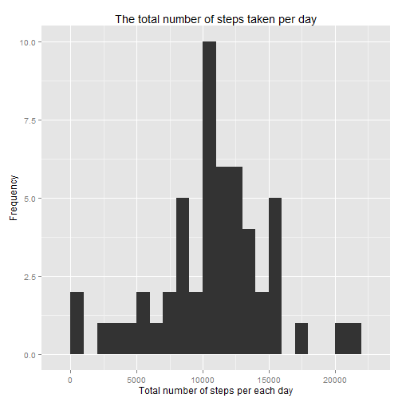
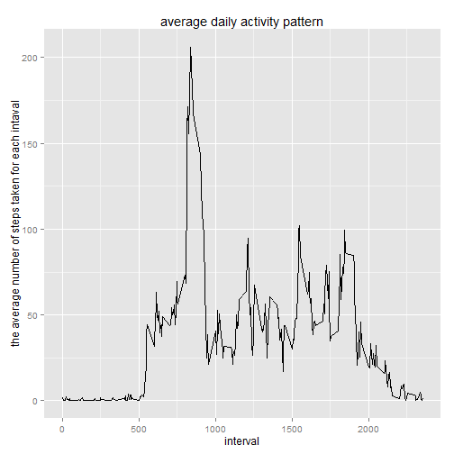
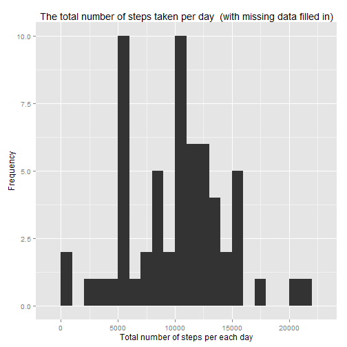
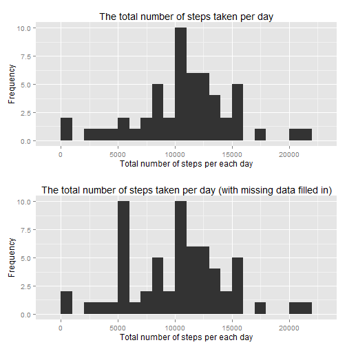
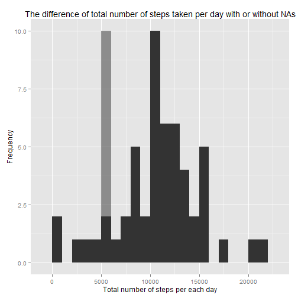
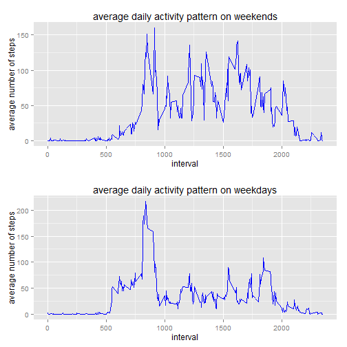

Reproducible Research: Peer Assessment 1
=============================================

```r
Sys.time()
```

```
## [1] "2014-05-16 15:26:15 JST"
```

This is my report for the assessment 1 of "Reproductive Research."

## Loading and preprocessing the data
I loaded the dataset, "Activity monitoring data." I saved the data as "raw.data."

```r
raw.data <- read.csv("activity.csv")
head(raw.data)
```

```
##   steps       date interval
## 1    NA 2012-10-01        0
## 2    NA 2012-10-01        5
## 3    NA 2012-10-01       10
## 4    NA 2012-10-01       15
## 5    NA 2012-10-01       20
## 6    NA 2012-10-01       25
```

```r
nrow(raw.data)
```

```
## [1] 17568
```

This raw data has many NA values and I made a data frame that does not have NAs.

```r
data.no.NA <- subset(raw.data, is.na(raw.data[, "steps"]) == FALSE)
head(data.no.NA)
```

```
##     steps       date interval
## 289     0 2012-10-02        0
## 290     0 2012-10-02        5
## 291     0 2012-10-02       10
## 292     0 2012-10-02       15
## 293     0 2012-10-02       20
## 294     0 2012-10-02       25
```

The date on which the mesurement was taken is;

```r
date.names <- levels(factor(raw.data$date))
date.names <- paste(substring(date.names, 6, 7), "/", substring(date.names, 
    9, 10), sep = "")
head(date.names, 3)
```

```
## [1] "10/01" "10/02" "10/03"
```

```r
tail(date.names, 3)
```

```
## [1] "11/28" "11/29" "11/30"
```

5-minute interval in which mesurement was taken is;

```r
int.names <- levels(as.factor(raw.data$interval))
head(int.names, 3)
```

```
## [1] "0"  "5"  "10"
```

```r
tail(int.names, 3)
```

```
## [1] "2345" "2350" "2355"
```

In the following, I used "ggplot2" so that I can make elegant graphics.

```r
library(ggplot2)
```


## What is mean total number of steps taken per day?
I saved the total number of steps taken per day to "tsd," ignoring the missing values.

```r
total.step.day <- tapply(data.no.NA$steps, data.no.NA$date, sum)
tsd <- data.frame(date = date.names, tsd = total.step.day)
head(tsd)
```

```
##             date   tsd
## 2012-10-01 10/01    NA
## 2012-10-02 10/02   126
## 2012-10-03 10/03 11352
## 2012-10-04 10/04 12116
## 2012-10-05 10/05 13294
## 2012-10-06 10/06 15420
```

And I made a histogram with ggplot2.

```r
g <- ggplot(tsd, aes(x = tsd))
g <- g + geom_histogram(binwidth = 1000)
g + labs(list(title = "The total number of steps taken per day", x = "Total number of steps per each day", 
    y = "Frequency"))
```

 

The mean and median of total number of steps taken per day is in this summary.

```r
summary(tsd)
```

```
##       date         tsd       
##  10/01  : 1   Min.   :   41  
##  10/02  : 1   1st Qu.: 8841  
##  10/03  : 1   Median :10765  
##  10/04  : 1   Mean   :10766  
##  10/05  : 1   3rd Qu.:13294  
##  10/06  : 1   Max.   :21194  
##  (Other):55   NA's   :8
```

To see only mean and median, I made objects, meanA and medianA.

```r
# only mean
(meanA <- mean(tsd$tsd, na.rm = TRUE))
```

```
## [1] 10766
```

```r
# only median
(medianA <- median(tsd$tsd, na.rm = TRUE))
```

```
## [1] 10765
```


## What is the average daily activity pattern?
I calculated the average number of steps taken for each intaval, with ignoring missing values. The values are averaged across all days.

```r
mean.int <- data.frame(interval = as.numeric(int.names), mean = as.vector(tapply(data.no.NA$steps, 
    data.no.NA$interval, mean)))
```

I made a time siries plot of the average number of steps taken vs. the 5-minutes interval.

```r
q <- ggplot(mean.int, aes(x = interval, y = mean)) + geom_line()
q + labs(list(title = "average daily activity pattern", x = "interval", y = "the average number of steps taken for each intaval"))
```

 

The interval contains the maximum averaged number of steps is;

```r
sort.data <- mean.int[order(mean.int$mean, decreasing = TRUE), ]
sort.data[1, "interval"]
```

```
## [1] 835
```


## Imputing missing values
Because NAs sometimes introduce  bias into analysis of data, I have to filling the misisng values in the dataset. The number of missing values in the dataset is;

```r
nrow(subset(raw.data, is.na(raw.data[, "steps"]) == TRUE))
```

```
## [1] 2304
```

For estimating the NA values, I used the arithmetic mean number of means of the day and the interval. For example, I explain about the first row of raw.data:

```r
raw.data[1, ]
```

```
##   steps       date interval
## 1    NA 2012-10-01        0
```

The mean number of steps of 10/2 is;

```r
mean.day <- data.frame(date = date.names, mean = as.vector(tapply(data.no.NA$steps, 
    data.no.NA$date, mean)))
mean.day[is.na(mean.day)] <- 0
mean.day[1, ]
```

```
##    date mean
## 1 10/01    0
```

the average number of steps taken for each intaval, with ignoring missing values;

```r
mean.int[is.na(mean.int)] <- 0
mean.int[1, ]
```

```
##   interval  mean
## 1        0 1.717
```

So, the NA value in the first row will be raplaced by the estimated number;

```r
(mean.day[1, 2] + mean.int[1, 2])/2
```

```
## [1] 0.8585
```

In the same way, 

```r
replaced <- raw.data

for (i in 1:nrow(replaced)) {
    if (is.na(replaced[i, "steps"]) == TRUE) {
        mean.today <- subset(mean.day, mean.day[, "date"] == paste(substring(replaced[i, 
            "date"], 6, 7), "/", substring(replaced[i, "date"], 9, 10), sep = ""))
        mean.the.int <- subset(mean.int, mean.int[, "interval"] == replaced[i, 
            "interval"])
        replaced[i, "steps"] <- (mean.today[1, 2] + mean.the.int[1, 2])/2
    }
}
head(replaced)
```

```
##     steps       date interval
## 1 0.85849 2012-10-01        0
## 2 0.16981 2012-10-01        5
## 3 0.06604 2012-10-01       10
## 4 0.07547 2012-10-01       15
## 5 0.03774 2012-10-01       20
## 6 1.04717 2012-10-01       25
```

I use "replaced" in the following analysis. This dataset is a new dataset that is the same as the original dataset but with the missing cells filled in.

The total number of steps taken per day is;

```r
tsd2 <- tapply(replaced$steps, replaced$date, sum)
tsd2 <- data.frame(date.names, tsd2)
head(tsd2)
```

```
##            date.names  tsd2
## 2012-10-01      10/01  5383
## 2012-10-02      10/02   126
## 2012-10-03      10/03 11352
## 2012-10-04      10/04 12116
## 2012-10-05      10/05 13294
## 2012-10-06      10/06 15420
```

Here is the histogram of the new dataset;

```r
p <- ggplot(tsd2, aes(x = tsd2))
p <- p + geom_histogram(binwidth = 1000)
p + labs(list(title = "The total number of steps taken per day  (with missing data filled in)", 
    x = "Total number of steps per each day", y = "Frequency"))
```

 

And I calculated the mean and median;

```r
summary(tsd2)
```

```
##    date.names      tsd2      
##  10/01  : 1   Min.   :   41  
##  10/02  : 1   1st Qu.: 6778  
##  10/03  : 1   Median :10395  
##  10/04  : 1   Mean   :10060  
##  10/05  : 1   3rd Qu.:12811  
##  10/06  : 1   Max.   :21194  
##  (Other):55
```

```r
meanB <- mean(tsd2$tsd2, na.rm = TRUE)  #only mean
medianB <- median(tsd2$tsd2, na.rm = TRUE)  #only median
```

To compare tsd and tsd2, I made multiple histograms in a screen.

```r
library(gridExtra)
```

```
## Loading required package: grid
```

```r
g <- g + labs(list(title = "The total number of steps taken per day", x = "Total number of steps per each day", 
    y = "Frequency"))
p <- p + labs(list(title = "The total number of steps taken per day (with missing data filled in)", 
    x = "Total number of steps per each day", y = "Frequency"))
grid.arrange(g, p, nrow = 2)
```

 

And I overayed multiple histograms.

```r
pg <- ggplot(data = tsd, aes(x = tsd))
pg <- pg + geom_histogram(binwidth = 1000)
pg <- pg + geom_histogram(data = tsd2, aes(x = tsd2), binwidth = 1000, alpha = 0.5)
pg + labs(list(title = "The difference of total number of steps taken per day with or without NAs", 
    x = "Total number of steps per each day", y = "Frequency"))
```

 

The difference between tsd and tsd2 is in the gray zone.
This zone makes the differences of mean and median number.

```r
meanA - meanB
```

```
## [1] 706
```

```r
medianA - medianB
```

```
## [1] 370
```


## Are there differences in activity patterns between weekdays and weekends?
First, I made a factor which has two levels-"weekday" and "weekend."
I set English as the language R prints with, and and added new column to the data frame "replaced."

```r
# print 'Date' in English
Sys.setlocale("LC_TIME", "English")
```

```
## [1] "English_United States.1252"
```

```r
# to see weekdays
replaced$weekdays <- weekdays(as.Date(raw.data$date), abbreviate = TRUE)
# convert into weekday,weekend
replaced$weekdays[replaced$weekdays == "Sun" | replaced$weekdays == "Sat"] <- "weekend"
replaced$weekdays[replaced$weekdays != "weekend"] <- "weekday"
```

Next, I calculated the mean numbers of steps taken, averaged across all weekday s or weekend days.

```r
end.data <- subset(replaced, replaced$weekdays == "weekend")
day.data <- subset(replaced, replaced$weekdays == "weekday")

end.int <- as.vector(tapply(end.data$steps, factor(end.data$interval), mean))
day.int <- as.vector(tapply(day.data$steps, factor(day.data$interval), mean))

week.int <- data.frame(interval = as.numeric(int.names), weekend = end.int, 
    weekday = day.int)
head(week.int)
```

```
##   interval  weekend weekday
## 1        0 0.107311 2.13669
## 2        5 0.021226 0.42264
## 3       10 0.008255 0.16436
## 4       15 0.009434 0.18784
## 5       20 0.004717 0.09392
## 6       25 3.380896 1.45073
```

Last, I made a panel plot conteining a time series plot, using ggplot2 and gridExtra.

```r
a <- ggplot(week.int, aes(x = interval, y = weekend)) + geom_line(col = "blue")
b <- ggplot(week.int, aes(x = interval, y = weekday)) + geom_line(col = "blue")
a <- a + labs(list(title = "average daily activity pattern on weekends", x = "interval", 
    y = "average number of steps"))
b <- b + labs(list(title = "average daily activity pattern on weekdays", x = "interval", 
    y = "average number of steps"))
grid.arrange(a, b, nrow = 2)
```

 


## Citation

Data;
https://d396qusza40orc.cloudfront.net/repdata%2Fdata%2Factivity.zip

Explanations for this assessment in GitHub;
https://github.com/rdpeng/RepData_PeerAssessment1.git

Tools of analysis;
R Core Team (2013). R: A language and environment for statistical
  computing. R Foundation for Statistical Computing, Vienna, Austria. URL
  http://www.R-project.org/.

H. Wickham. ggplot2: elegant graphics for data analysis. Springer New
  York, 2009. URL http://had.co.nz/ggplot2/book

Baptiste Auguie (2012). gridExtra: functions in Grid graphics. R package
  version 0.9.1. http://CRAN.R-project.org/package=gridExtra
